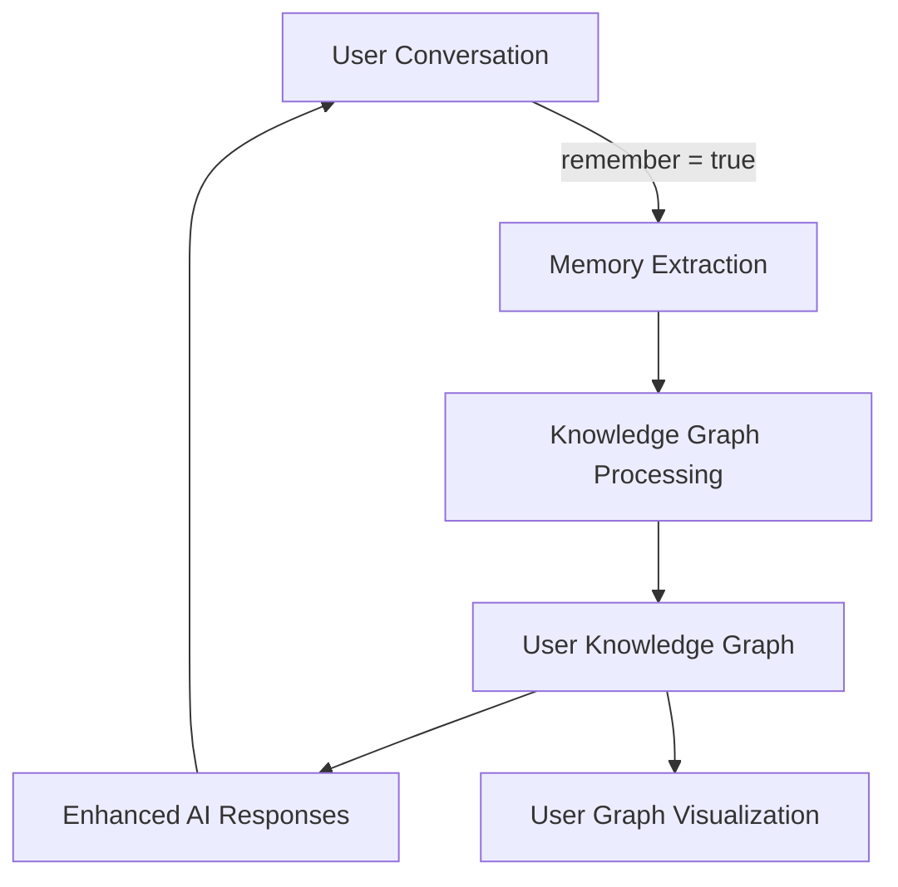
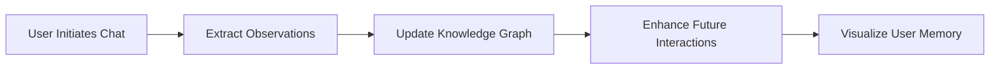

ChatGPT recently rolled out a [memory](https://x.com/OpenAI/status/1910378768172212636) feature, and like many, I was pretty impressed. The idea of an AI that remembers past conversations and can draw on that context for more personalized interactions is compelling. Naturally, my mind immediately went to how we could integrate something similar into our own open-source project, Morphik.

> 💡 **Key Insight**: Memory features allow AI systems to build personalized context over time, transforming one-off interactions into ongoing relationships.

Morphik is all about empowering developers to build context-aware applications. So, building a memory feature felt like a natural extension. We envisioned a system where users could flag conversations as "remember = true," and Morphik would then ingest the entire dialogue, ideally as a knowledge graph. This "User Knowledge Graph" (UKG) would then serve as a source of hyper-personalized information, learning more about the user across multiple chats.

I decided to use two AI models for this project: Gemini for planning and Claude Code for implementation. My idea was to have Gemini break down the high-level goals into steps while Claude Code would handle the actual coding work. The reason for using Gemini was its huge context window - I could just throw our entire codebase at it and it would be able to handle it. The reason to use Claude code was that I was generally impressed with Anthropic's work with Claude, and Claude 3.7 seems to be the best at the coding benchmarks anyways. 

I started by providing Gemini with our codebase and a detailed prompt outlining my vision for integrating chat-like completions and memory using a user knowledge graph. Gemini delivered an impressive plan. It outlined the tasks required, from creating new API endpoints and integrating basic RAG to setting up the UKG database and implementing the memory ingestion logic. Crucially, for each task, Gemini suggested specific tests and sanity checks – acting like checkpoints to ensure we were on the right track. For instance, for the initial chat API endpoint, it recommended verifying the server response, the dummy output, and even checking for proper authentication and handling of missing fields. This level of detail was exactly what I was looking for.

> ⚙️ **Development Approach**: Start with high-level architecture planning before diving into implementation details. Having checkpoints and tests for each stage ensures you're building on solid foundations.

With this plan in hand, I turned to Claude Code, ready to delegate the individual coding tasks. However, this is where things got… interesting.

While Claude Code could generate code, it often struggled with the bigger picture. For example, when it came to handling completions, it decided to cram all the logic into our `document_service` file, which is intended to be more of an orchestrator than a place for core logic. The resulting function ballooned to around 300 lines, filled with over-engineered solutions and assumptions about code that didn't even exist. It seemed to anticipate random issues and build solutions for problems we hadn't even encountered yet.

> ⚠️ **Challenge**: AI coding assistants may not understand architectural boundaries and can produce overly complex solutions that don't align with your existing codebase structure.

This tendency to over-engineer and misplace code became a recurring theme. It was frustrating to constantly redirect Claude Code and untangle its overly complex creations. While Gemini had provided a clear and logical roadmap, Claude Code seemed to have its own, often convoluted, route in mind.

Eventually, I decided to shift gears and primarily rely on Gemini for the core implementation. While my initial idea of a perfect division of labor didn't quite pan out, the experience highlighted the distinct strengths of each model. Gemini excelled at understanding the overall architecture and creating a coherent plan, while Claude Code, despite its struggles with complexity, might be more suitable for simpler, more isolated coding tasks.

So, how did we actually build Morphik Memory? The core idea revolves around using [knowledge graphs](https://docs.morphik.ai/concepts/knowledge-graphs). When a user initiates a chat and the `remember` flag is set to true, we take the conversation and extract key observations. These observations are then added to a dedicated knowledge graph associated with that specific user, identified by their user ID. This means that each user has their own evolving knowledge graph, capturing the essence of their interactions with the system.

What's particularly cool is that we've also implemented a visualization feature. Users can actually see their conversation history represented as a graph, allowing them to gain insights into the topics they discuss most frequently and the system's observations about them over time. We used PostgreSQL for our database and leveraged our existing knowledge graph functionalities, including tools like force-directed graphs for visualization.

One of the key principles behind Morphik is our commitment to open source. We believe in transparency and the power of community collaboration. By making Morphik Memory open-source (you can check out the code at [https://github.com/morphik-org/morphik-core](https://github.com/morphik-org/morphik-core)), we invite others to inspect our implementation, verify its security, and even contribute to its development. We also offer a hosted service for those who prefer a [managed solution](https://morphik.ai).

> 🚀 **Open Source Value**: By making memory features open-source, we enable developers to understand exactly how their users' data is being processed and stored, building trust through transparency.

Building Morphik Memory was a fascinating journey, full of learning and a healthy dose of "vibe-coding." While my initial plan to perfectly utilize both Gemini and Claude Code didn't fully materialize, it underscored the importance of choosing the right tool for the right job. More importantly, it resulted in a powerful, open-source alternative to ChatGPT's memory feature that we're incredibly excited to share with the developer community.

We'd love for you to explore Morphik Memory, give us your feedback, and maybe even contribute! Head over to our GitHub repository, give us a star, and let us know what you think. Have you attempted something similar? We're eager to hear about your experiences!