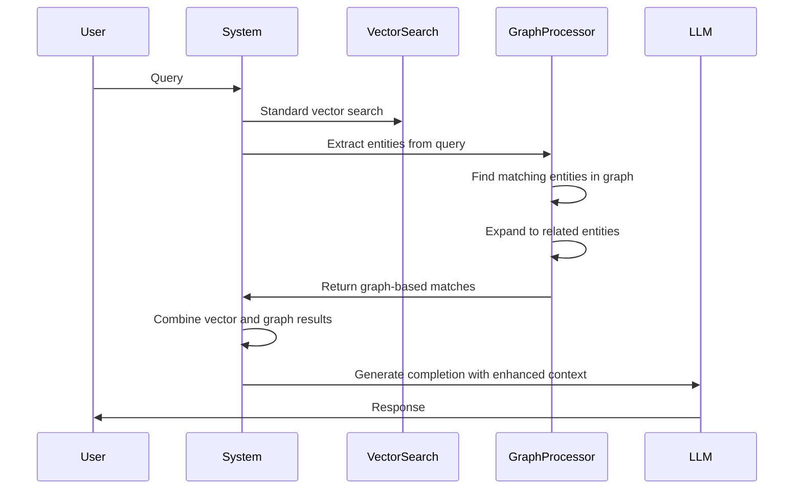

## Introduction
Traditional Retrieval-Augmented Generation (RAG) systems typically use vector-based similarity searches to find relevant documents. While effective for straightforward queries, vector searches often struggle with more nuanced information needs that involve understanding connections between entities dispersed across multiple documents.

That's where knowledge graphs come into play. Unlike traditional vector-based approaches, knowledge graphs explicitly capture entities and their relationships, uncovering connections that otherwise might be missed.

Consider three simple documents:

1. "Elon Musk is the CEO of SpaceX."
2. "Starship is a spacecraft developed by SpaceX, designed for missions to Mars."
3. "Tesla produces electric vehicles, and Elon Musk serves as its CEO."

If a user queries, "Who leads the companies involved in Mars exploration, and what other companies does this individual lead?", a traditional vector search might only identify the second document about mars, and space, potentially overlooking Elon Musk's relationship with Tesla and SpaceX. In contrast, a knowledge graph explicitly represents these interconnected relationships, providing a comprehensive, context-rich answer by traversing connections across all three documents. Let's dig into why and how?

## Core Concepts

### What is a Knowledge Graph?

A knowledge graph is a structured representation of information that consists of:

- **Entities**: Distinct objects, concepts, or things (e.g., people, organizations, products, technologies)
- **Relationships**: Connections between entities that describe how they relate to each other
- **Properties** (optional): Additional attributes that describe entities or relationships

The example we will build will finally look like:


## Implementation in Morphik

Morphik's knowledge graph implementation is built on several core components:

### Entity and Relationship Extraction

When you create a knowledge graph, Morphik processes your documents to extract entities and relationships. Entities and relationships are extracted for every chunk of the documents requested for creation. This is implemented in the `GraphService` class:

```python
async def extract_entities_from_text(self, content: str, doc_id: str, chunk_number: int) -> Tuple[List[Entity], List[Relationship]]:
    """Extract entities and relationships from text content using the LLM."""
    # Process content using a language model
    # Returns structured data with entities and relationships
```

The system uses language models to identify entities and relationships between entities of various types:

- People (e.g., "Sam Altman")
- Organizations (e.g., "OpenAI")
- Locations (e.g., "San Francisco")
- Technologies (e.g., "Machine Learning")
- Concepts (e.g., "Retrieval Augmented Generation")
- Products (e.g., "GPT-4")
- Events (e.g., "AI Conference 2025")
- And more...

### Entity Resolution

One challenge with extracting entities from text is that the same entity might be referenced in different ways. For example, "Sam Altman", "Samuel H. Altman", and "OpenAI CEO" might all refer to the same person.

Morphik addresses this with entity resolution, implemented in the `EntityResolver` class:

```python
async def resolve_entities(self, entities: List[Entity]) -> Tuple[List[Entity], Dict[str, str]]:
    """Resolves entities by identifying and grouping similar entities."""
    # Use LLM to identify variants of the same entity
    # Create mapping from variants to canonical forms
    # Merge properties of duplicate entities
```

This ensures that the knowledge graph accurately represents unique entities and their relationships, even when they're referenced inconsistently across documents.

### Custom Prompts and Examples

Knowledge graphs in Morphik can be enhanced with custom prompts and examples to improve entity extraction and resolution:

- **Entity Extraction Customization**: You can provide examples and custom prompt templates to guide how entities and relationships are identified, making the extraction process more domain-specific.
- **Entity Resolution Customization**: You can provide examples of how entity variants should be recognized and merged, helping the system correctly identify when different terms refer to the same entity.

This customization allows for more precise knowledge graph creation, ensuring that the extracted entities and relationships align with your specific information needs and domain terminology.

Here's an example of creating a knowledge graph with custom prompts and examples:

```python
from morphik import Morphik
from morphik.models import (
    EntityExtractionExample, 
    EntityResolutionExample,
    EntityExtractionPromptOverride, 
    EntityResolutionPromptOverride,
    GraphPromptOverrides
)

# Connect to Morphik
db = Morphik()

# Create a knowledge graph with custom entity extraction and resolution
graph = db.create_graph(
    name="medical_knowledge_graph",
    filters={"domain": "medical"},
    prompt_overrides=GraphPromptOverrides(
        # Customize entity extraction
        entity_extraction=EntityExtractionPromptOverride(
            # Custom examples to guide entity extraction toward medical domain
            examples=[
                EntityExtractionExample(
                    label="Type 2 Diabetes", 
                    type="CONDITION"
                ),
                EntityExtractionExample(
                    label="Metformin", 
                    type="MEDICATION",
                    properties={"class": "biguanide"}
                ),
                EntityExtractionExample(
                    label="Cardiovascular Disease", 
                    type="CONDITION"
                )
            ],
            # Optional custom prompt template
            prompt_template=(
                "Extract medical entities and relationships from the following text.\n"
                "Focus on conditions, medications, treatments, and healthcare providers.\n"
                "{examples}\n\n"
                "Text to analyze:\n{content}\n\n"
                "Return your analysis as JSON with 'entities' and 'relationships' arrays."
            )
        ),
        # Customize entity resolution
        entity_resolution=EntityResolutionPromptOverride(
            # Examples of how entity variants should be resolved
            examples=[
                EntityResolutionExample(
                    canonical="Type 2 Diabetes",
                    variants=["T2DM", "type 2 diabetes", "Type II Diabetes"]
                ),
                EntityResolutionExample(
                    canonical="Metformin",
                    variants=["Glucophage", "metformin hydrochloride"]
                )
            ]
        )
    )
)

# Query the graph with relationship paths
response = db.query(
    "What medications are used to treat diabetes and what complications are associated with it?",
    graph_name="medical_knowledge_graph",
    hop_depth=2,  # Follow connections up to 2 relationships away
    include_paths=True  # Include relationship paths in response
)
```

In this example, we provide custom guidance for both entity extraction and entity resolution:

1. **Entity Extraction**: We provide examples of medical entities to extract (conditions and medications) and a custom prompt template that focuses the extraction on medical terminology.

2. **Entity Resolution**: We provide examples of how different terms for the same medical concept should be merged (e.g., "T2DM" and "Type II Diabetes" should be treated as "Type 2 Diabetes").

This approach is particularly valuable for specialized domains with complex terminology where the default extraction might miss important entities or relationships.

### Graph Construction and Storage

The extracted entities and relationships are stored in a graph structure:

```python
class Entity(BaseModel):
    """Represents an entity in a knowledge graph"""
    id: str
    label: str
    type: str
    properties: Dict[str, Any]
    document_ids: List[str]
    chunk_sources: Dict[str, List[int]]

class Relationship(BaseModel):
    """Represents a relationship between entities in a knowledge graph"""
    id: str
    source_id: str
    target_id: str
    type: str
    document_ids: List[str]
    chunk_sources: Dict[str, List[int]]

class Graph(BaseModel):
    """Represents a knowledge graph"""
    id: str
    name: str
    entities: List[Entity]
    relationships: List[Relationship]
    metadata: Dict[str, Any]
    document_ids: List[str]
    filters: Optional[Dict[str, Any]]
    # Additional fields...
```

Each entity and relationship maintains references to the documents and chunks where they were found, enabling the system to retrieve the original context when needed.

### Graph-Enhanced Retrieval

When querying with a knowledge graph, Morphik enhances the retrieval process:



This process is implemented in the `query_with_graph` method:

```python
async def query_with_graph(
    self,
    query: str,
    graph_name: str,
    auth: AuthContext,
    document_service,
    filters: Optional[Dict[str, Any]] = None,
    k: int = 20,
    hop_depth: int = 1,
    include_paths: bool = False,
    # Other parameters...
) -> CompletionResponse:
    """Generate completion using knowledge graph-enhanced retrieval."""
    # Extract entities from query
    # Find similar entities in graph
    # Expand to related entities (up to hop_depth)
    # Retrieve chunks containing these entities
    # Combine with vector search results
    # Generate completion with enhanced context
```

The `hop_depth` parameter controls how far to traverse the graph from the initial entities, allowing you to balance between focused and comprehensive retrieval.

## Using Knowledge Graphs in Morphik

### Creating a Knowledge Graph

You can create a knowledge graph from your documents using the Python SDK or the UI component. I'll show the SDK below, UI should be simpler.

```python
from morphik import Morphik

# Connect to Morphik
db = Morphik()

# Create a knowledge graph from all documents with category "tech"
graph = db.create_graph(
    name="tech_knowledge_graph",
    filters={"category": "tech"}
)

# Alternatively, create from specific documents
graph = db.create_graph(
    name="project_knowledge_graph",
    documents=["doc_id_1", "doc_id_2", "doc_id_3"]
)
```

Behind the scenes, Morphik:
1. Retrieves the matching documents
2. Processes each document to extract entities and relationships
3. Performs entity resolution to eliminate duplicates
4. Constructs the graph and saves it

### Querying with a Knowledge Graph

Once you've created a knowledge graph, you can use it to enhance your queries:

```python
# Basic query with a knowledge graph
response = db.query(
    "How is AI technology being used in healthcare?",
    graph_name="tech_knowledge_graph"
)

# Advanced query with custom hop depth and path information
response_with_paths = db.query(
    "What technologies are used for analyzing electronic health records?",
    graph_name="tech_knowledge_graph",
    hop_depth=2,  # Consider connections up to 2 hops away
    include_paths=True  # Include explanation of entity relationships
)

# If path information is included, it will be in the response metadata
if response_with_paths.metadata and "graph" in response_with_paths.metadata:
    print("\nGraph paths found:")
    for path in response_with_paths.metadata["graph"]["paths"]:
        print(" -> ".join(path))
```

The `hop_depth` parameter determines how far to traverse the graph from the initial entities found in the query. A higher value casts a wider net but may include less relevant information.

When `include_paths=True`, the response includes the paths through the graph that led to the retrieved documents, providing explainability for why certain information was included.

## Example: Building a Healthcare Knowledge Graph

Let's walk through a complete example of using knowledge graphs for a healthcare application:

```python
import os
from morphik import Morphik

# Connect to Morphik
db = Morphik()

# Ingest healthcare documents
doc1 = db.ingest_file("medical_research.pdf", metadata={"domain": "healthcare", "type": "research"})
doc2 = db.ingest_file("patient_data.pdf", metadata={"domain": "healthcare", "type": "clinical"})
doc3 = db.ingest_file("treatment_protocols.pdf", metadata={"domain": "healthcare", "type": "protocol"})

# Create a healthcare knowledge graph
graph = db.create_graph(
    name="healthcare_knowledge_graph",
    filters={"domain": "healthcare"}
)

print(f"Created graph with {len(graph.entities)} entities and {len(graph.relationships)} relationships")

# Query using the knowledge graph
response = db.query(
    "What treatments are effective for patients with diabetes and hypertension?",
    graph_name="healthcare_knowledge_graph",
    hop_depth=2,
    include_paths=True
)

print("\nResponse:")
print(response.completion)

# Display relationship paths that informed the response
if response.metadata and "graph" in response.metadata:
    print("\nEvidence paths:")
    for path in response.metadata["graph"]["paths"]:
        print(" -> ".join(path))
```

In this example, the knowledge graph might identify entities like:
- Conditions: "Diabetes", "Hypertension"
- Treatments: "Insulin", "ACE inhibitors", "Lifestyle modifications"
- Outcomes: "Blood sugar control", "Blood pressure reduction"

And relationships like:
- "Insulin" -> "treats" -> "Diabetes"
- "ACE inhibitors" -> "treats" -> "Hypertension"
- "Diabetes" -> "comorbid with" -> "Hypertension"
- "Lifestyle modifications" -> "improves" -> "Blood sugar control"
- "Lifestyle modifications" -> "improves" -> "Blood pressure reduction"

The graph traversal might find that "Lifestyle modifications" is effective for both conditions, even if that connection wasn't explicitly stated in a single document.

## Graph Visualization

When working with knowledge graphs, visualization can provide valuable insights into the structure and connections within your data.


### Updating Existing Graphs

As your document collection grows, you can update existing graphs:

```python
# Add new documents to an existing graph
updated_graph = db.update_graph(
    name="tech_knowledge_graph",
    additional_documents=["new_doc_id_1", "new_doc_id_2"]
)

# Or add documents matching new filters
updated_graph = db.update_graph(
    name="tech_knowledge_graph",
    additional_filters={"source": "research_papers"}
)
```

Without any arguments, the function will check if something for the filter has been updated and if so will add the docs to the graph.

## Even more Implementation Details (for the nerds)

### Graph Traversal Algorithm

The core of knowledge graph querying is the entity expansion algorithm, which traverses the graph to find related entities:

```python
def _expand_entities(self, graph: Graph, seed_entities: List[Entity], hop_depth: int) -> List[Entity]:
    """Expand entities by traversing relationships with improved connectivity."""
    if hop_depth <= 1:
        return seed_entities

    # Create a set of entity IDs we've seen
    seen_entity_ids = {entity.id for entity in seed_entities}
    all_entities = list(seed_entities)

    # Create indices for efficient lookup
    entity_map = {entity.id: entity for entity in graph.entities}
    relationship_index = self._build_relationship_index(graph.relationships)

    # For each hop
    for _ in range(hop_depth - 1):
        new_entities = []

        # For each entity we've found so far
        for entity in all_entities:
            # Find connected entities through relationships
            connected_ids = self._get_connected_entity_ids(
                relationship_index.get(entity.id, []), entity.id, seen_entity_ids
            )

            # Add new connected entities
            for entity_id in connected_ids:
                if target_entity := entity_map.get(entity_id):
                    new_entities.append(target_entity)
                    seen_entity_ids.add(entity_id)

        # Add new entities to our list
        all_entities.extend(new_entities)

        # Stop if no new entities found
        if not new_entities:
            break

    return all_entities
```

This algorithm efficiently expands from the initial entities found in the query to related entities, gathering relevant context for the retrieval process.

### Entity Resolution

The entity resolution process is crucial for maintaining a clean, accurate knowledge graph:

```python
async def _resolve_with_llm(self, entity_labels: List[str]) -> List[Dict[str, Any]]:
    """Use LLM to resolve entities by identifying and grouping similar entities."""
    # Group similar entity labels using a language model
    # Example output:
    # [
    #   {"canonical": "OpenAI", "variants": ["OpenAI Inc.", "OpenAI Corporation"]},
    #   {"canonical": "GPT-4", "variants": ["GPT4", "GPT 4", "OpenAI GPT-4"]}
    # ]
```

This approach allows the system to recognize different references to the same entity, improving retrieval accuracy.

## Performance Considerations

Knowledge graph operations involve several performance considerations:

1. **Graph Creation Time**: Creating a graph involves processing all documents with LLMs, which can be time-consuming for large document collections.

2. **Query Processing Overhead**: Graph-enhanced retrieval requires extra processing compared to standard vector search but often produces more comprehensive results.

3. **Graph Size**: As the number of entities and relationships grows, memory usage increases, and traversal operations may become more expensive.

Performance tips:

- Use metadata filters to create focused graphs rather than one large graph for all documents
- Start with smaller hop depths (1 or 2) and increase only if needed
- Consider the tradeoff between processing time and retrieval quality

## Conclusion

Knowledge graphs in Morphik provide a powerful way to enhance retrieval by capturing and leveraging relationships between entities in your documents. By combining traditional vector search with graph-based retrieval, Morphik delivers more comprehensive and contextually relevant information for complex queries.

Whether you're building applications in healthcare, finance, research, or any domain with complex information relationships, knowledge graphs can significantly improve the quality of information retrieval and generation.

## Next Steps

To get started with knowledge graphs in your Morphik applications:

1. Review your document collection and identify domains that would benefit from relationship-aware retrieval
2. Create focused knowledge graphs for these domains
3. Experiment with different hop depths and query formulations
4. Consider including path information to understand how the system connects information

For more advanced use cases, explore combining knowledge graphs with other Morphik features like ColPali for multi-modal retrieval.
