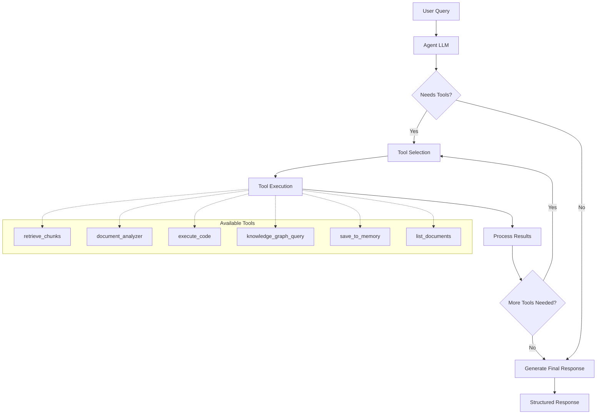

The Morphik Agent is an intelligent assistant that autonomously uses various tools to answer complex queries and perform sophisticated analysis tasks. Unlike traditional retrieval-augmented generation (RAG) systems that follow a fixed pipeline, the agent can dynamically decide which tools to use, execute code, analyze documents, and even save insights to memory for future reference.

## How It Works

### Architecture Overview

The Morphik Agent operates using a function-calling LLM (Large Language Model) that can:

1. **Analyze the Query**: Understand what the user is asking for
2. **Plan Tool Usage**: Decide which tools are needed to answer the query
3. **Execute Tools**: Call the appropriate tools with the right parameters
4. **Process Results**: Analyze tool outputs and decide if more tools are needed
5. **Generate Response**: Provide a comprehensive answer with structured content



### Tool Ecosystem

The agent has access to eight core tools:

#### Document Operations
- **`retrieve_chunks`**: Search and retrieve relevant text/image chunks
- **`retrieve_document`**: Get full document content or metadata
- **`document_analyzer`**: Extract entities, facts, summaries, sentiment
- **`list_documents`**: Discover available documents

#### Knowledge Operations  
- **`knowledge_graph_query`**: Query entities, relationships, and paths
- **`list_graphs`**: Discover available knowledge graphs

#### Computation
- **`execute_code`**: Run Python code in a secure sandbox

#### Memory
- **`save_to_memory`**: Store insights for future queries

## Key Capabilities

### 1. Multi-Step Analysis

The agent can break down complex requests into multiple steps:

```python
# User asks: "Analyze sales trends and predict next quarter"
# Agent autonomously:
# 1. Lists sales documents
# 2. Retrieves sales data chunks  
# 3. Analyzes trends using document_analyzer
# 4. Executes Python code for predictions
# 5. Saves insights to memory
# 6. Generates comprehensive report

result = db.agent_query(
    "Analyze our sales trends over the last year and predict "
    "performance for next quarter. Save key insights for future reference."
)
```

### 2. Code Execution

The agent can write and execute Python code for calculations, data analysis, and visualization:

```python
# Agent can automatically write code like this:
"""
import pandas as pd
import matplotlib.pyplot as plt

# Parse sales data from retrieved chunks
sales_data = [...]  # Data from document chunks
df = pd.DataFrame(sales_data)

# Calculate growth rate
growth_rate = (df['Q4'] - df['Q1']) / df['Q1'] * 100

# Create visualization
plt.plot(df['quarter'], df['sales'])
plt.title('Sales Trends')
plt.savefig('sales_trends.png')

print(f"Growth rate: {growth_rate:.2f}%")
"""
```

### 3. Knowledge Graph Exploration

The agent can navigate complex relationships in your data:

```python
result = db.agent_query(
    "How are our enterprise customers connected to our premium products? "
    "Show me the relationship paths and identify expansion opportunities."
)

# Agent might:
# 1. List available graphs
# 2. Query for enterprise customer entities
# 3. Find paths to premium products
# 4. Analyze relationship strengths
# 5. Generate expansion strategy
```

### 4. Memory and Context

The agent can remember important insights across queries:

```python
# First interaction
result1 = db.agent_query("Analyze customer churn patterns and save findings")

# Later interaction - agent remembers previous analysis
result2 = db.agent_query("Based on our churn analysis, what retention strategies should we implement?")
```

## Response Structure

The agent returns a rich, structured response with four components:

### 1. Final Response (`response`)
The main textual answer to your query.

### 2. Tool History (`tool_history`)
Complete audit trail of all tool executions:
```json
[
  {
    "tool_name": "list_documents",
    "tool_args": {"filters": {"department": "sales"}},
    "tool_result": "Found 15 sales documents..."
  },
  {
    "tool_name": "execute_code", 
    "tool_args": {"code": "growth_rate = (Q4 - Q1) / Q1 * 100"},
    "tool_result": "Growth rate: 23.5%"
  }
]
```

### 3. Display Objects (`display_objects`)
Structured content for rich presentation:
```json
[
  {
    "type": "text",
    "content": "## Sales Analysis\nGrowth rate increased by 23.5%...",
    "source": "doc123-chunk1"
  },
  {
    "type": "image",
    "content": "<base64_image_data>",
    "caption": "Sales trend chart showing quarterly growth",
    "source": "doc456-chart2"
  }
]
```

### 4. Sources (`sources`)
Attribution for all referenced content:
```json
[
  {
    "sourceId": "doc123-chunk1",
    "documentName": "Q3 Sales Report",
    "documentId": "123",
    "content": "Sales increased significantly..."
  }
]
```

## When to Use the Agent

### Choose `agent_query` for:

✅ **Complex Analysis Tasks**
- Multi-step analysis requiring different tools
- Data analysis with calculations
- Research requiring document discovery

✅ **Computation Requirements**  
- Statistical analysis
- Data visualization
- Mathematical calculations

✅ **Knowledge Graph Exploration**
- Relationship discovery
- Entity connection analysis
- Path finding between concepts

✅ **Multi-Modal Content**
- Analyzing both text and images
- Extracting information from charts/diagrams

✅ **Memory-Dependent Tasks**
- Building on previous analysis
- Maintaining context across queries

### Choose regular `query` for:

✅ **Simple Q&A**
- Direct questions about document content
- Quick information retrieval
- Straightforward fact-finding

✅ **Performance-Critical Applications**
- When speed is more important than depth
- Simple document lookup scenarios

## Best Practices

### 1. Query Design

**Be Specific About Goals:**
```python
# Good: Clear outcome desired
"Analyze customer satisfaction scores, identify trends, and recommend improvements"

# Less optimal: Vague request  
"Tell me about customers"
```

**Include Analysis Context:**
```python
# Good: Provides direction
"Calculate quarterly revenue growth and compare to industry benchmarks"

# Less optimal: Missing context
"Show me revenue numbers"
```

### 2. Response Processing

**Check Tool History for Understanding:**
```python
result = db.agent_query("Complex analysis request")

# Understand what the agent did
for tool in result["tool_history"]:
    print(f"Used {tool['tool_name']} with {tool['tool_args']}")
```

**Use Display Objects for Rich Content:**
```python
for obj in result["display_objects"]:
    if obj["type"] == "image":
        # Display image in UI with caption
        display_image(obj["content"], caption=obj["caption"])
    elif obj["type"] == "text":
        # Render markdown content
        render_markdown(obj["content"])
```

### 3. Error Handling

```python
def safe_agent_query(query):
    try:
        result = db.agent_query(query)
        
        # Check for errors in response
        if "error" in result.get("response", "").lower():
            return {"error": "Agent encountered an error", "details": result["response"]}
            
        # Check if any tools failed
        failed_tools = [
            tool for tool in result.get("tool_history", [])
            if "error" in str(tool.get("tool_result", "")).lower()
        ]
        
        if failed_tools:
            return {"error": "Some tools failed", "failed_tools": failed_tools}
            
        return result
        
    except Exception as e:
        return {"error": "Agent query failed", "exception": str(e)}
```

### 4. Memory Usage

```python
# Use memory for cumulative analysis
queries = [
    "Analyze customer segments and save key characteristics",
    "Based on customer segments, identify high-value opportunities", 
    "Create action plan for the top 3 opportunities identified"
]

for query in queries:
    result = db.agent_query(query)
    print(f"Query: {query}")
    print(f"Response: {result['response']}\n")
```

## Performance Considerations

### Response Time
- Agent queries typically take 10-60 seconds depending on complexity
- Each tool call adds processing time
- Complex code execution can extend response time

### Cost Implications
- Uses more LLM tokens than regular queries
- Cloud deployments may have usage limits
- Tool execution (especially code) consumes additional resources

### Context Window Management
- Very complex queries may hit LLM context limits
- Agent automatically manages context but extremely long sessions may fail
- Consider breaking very complex tasks into smaller queries

## Security Model

### Code Execution Sandbox
- Python code runs in a secure, isolated environment
- No access to file system or network
- Limited to approved libraries and functions
- Execution time limits prevent infinite loops

### Data Access
- Agent respects same access controls as other Morphik operations
- Cannot access documents outside user's permissions
- Memory storage follows same security model

### Tool Limitations
- Tools cannot perform destructive operations
- No ability to modify or delete documents
- Read-only access to knowledge graphs
- Memory is scoped to user/session

## Comparison with Traditional RAG

| Aspect | Traditional RAG | Morphik Agent |
|--------|----------------|---------------|
| **Workflow** | Fixed: Retrieve → Generate | Dynamic: Plan → Execute → Iterate |
| **Tool Access** | None | Full tool ecosystem |
| **Computation** | None | Python code execution |
| **Memory** | Stateless | Persistent memory |
| **Response Format** | Simple text | Structured with attribution |
| **Use Cases** | Simple Q&A | Complex analysis |
| **Processing Time** | Fast (seconds) | Moderate (tens of seconds) |
| **Cost** | Lower | Higher |

## Future Roadmap

The Morphik Agent will continue to evolve with:

- **Additional Tools**: Web search, API integrations, file operations
- **Improved Planning**: Better tool selection and optimization
- **Enhanced Memory**: Longer-term memory with better organization
- **Custom Tools**: User-defined tools and functions
- **Multi-Agent Orchestration**: Specialized agents for different domains

The agent represents a significant evolution from traditional RAG systems, enabling complex analytical workflows that were previously impossible with simple retrieval-based approaches. 