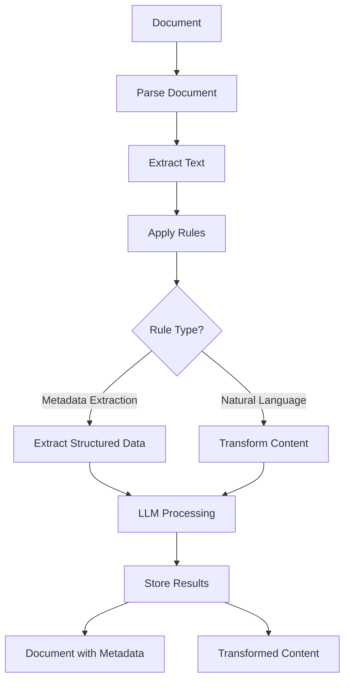
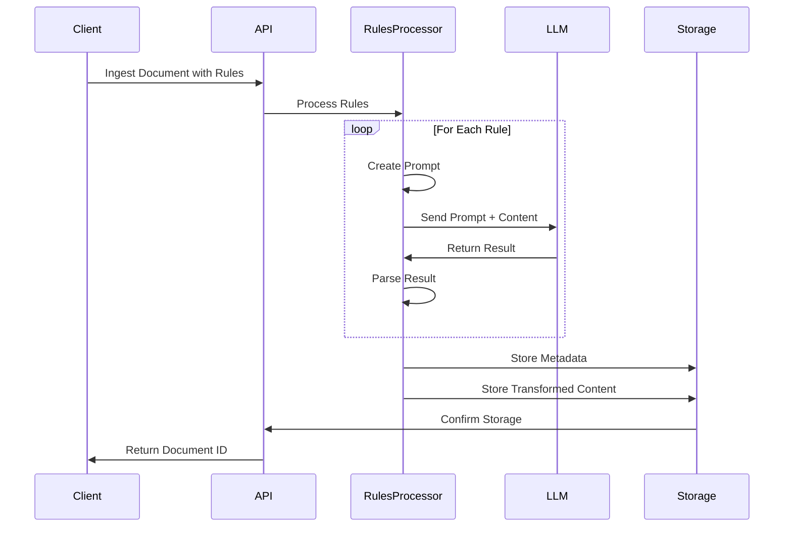

# DataBridge: Rules-Based Document Ingestion

Rules! Rules! Rules! LLMs are exceptionally good at transforming content and extracting relevant information, making them ideal building blocks for robust document processing. However, without clear rules, even the most advanced LLMs can struggle to deliver consistent and precise outcomes. DataBridge leverages the power of LLMs, guided by user-defined rules, eliminating the need for developers to create complex custom pipelines. With rules acting as straightforward instructions, we enable reliable, repeatable document processing to unlock the full potential of your unstructured data.

This explainer outlines the powerful rules-based document ingestion capabilities in DataBridge, focusing on practical use cases like metadata extraction and content transformation.

## Core Concepts

DataBridge's rules system currently allows for two key operations during document ingestion:

1. **Metadata Extraction**: Pull structured information from documents into searchable metadata.
2. **Content Transformation**: Modify document content during ingestion (redaction, summarization, etc.).

Rules are processed in sequence, allowing you to chain operations (e.g., extract metadata from a document, then redact sensitive information).

## Architecture Overview



The rules engine works by:

1. Accepting rules definitions during document ingestion
2. Converting each rule to the appropriate model class
3. Sequentially applying rules to document content
4. Using an LLM to perform extractions or transformations
5. Storing both the extracted metadata and modified content

## Rule Types

### MetadataExtractionRule

This rule type extracts structured data from document content according to a schema. It's perfect for converting unstructured documents into structured, queryable data.

```python
from databridge-client import DataBridge
from databridge-client.rules import MetadataExtractionRule
from pydantic import BaseModel

# Define a schema for the metadata you want to extract
class ResumeInfo(BaseModel):
    name: str
    email: str
    phone: str
    skills: list[str]
    education: list[dict]
    experience: list[dict]

# Connect to DataBridge
db = DataBridge()

# Ingest a resume with metadata extraction
doc = db.ingest_file(
    "resume.pdf",
    metadata={"type": "resume"},
    rules=[
        MetadataExtractionRule(schema=ResumeInfo)
    ]
)

# The extracted metadata is now available
print(f"Candidate: {doc.metadata['name']}")
print(f"Skills: {', '.join(doc.metadata['skills'])}")
print(f"Education: {len(doc.metadata['education'])} entries")
```

### NaturalLanguageRule

This rule type transforms document content according to natural language instructions. It's perfect for redaction, summarization, formatting changes, etc.

```python
from databridge-client import DataBridge
from databridge-client.rules import NaturalLanguageRule

# Connect to DataBridge
db = DataBridge()

# Ingest a document with PII redaction
doc = db.ingest_file(
    "medical_record.pdf",
    rules=[
        NaturalLanguageRule(
            prompt="Remove all personally identifiable information (PII) including patient names, " 
                  "addresses, phone numbers, and any other identifying details. Replace with [REDACTED]."
        )
    ]
)

# The document is stored with PII removed
```

## Technical Implementation

Under the hood, the rules processing system leverages Language Models (LLMs) to perform both metadata extraction and content transformation. The system is designed to be modular and configurable.

### LLM Integration

DataBridge supports multiple LLM providers:

1. **OpenAI**: For high-quality results with cloud-based processing
2. **Ollama**: For self-hosted, private LLM deployments

The LLM provider is configured in your `databridge.toml` file:

```toml
[rules]
provider = "openai"  # or "ollama" for self-hosted
model = "gpt-4o"     # or your preferred model
batch_size = 4096      # Size of content to process at once
```

### Rules Processing Logic

When a document with rules is ingested:

1. The document is parsed and text is extracted
2. The rules are validated and converted to model classes
3. For each rule:
   - The appropriate prompt is constructed based on rule type
   - The prompt and document content are sent to the LLM
   - The LLM's response is parsed (JSON for metadata, plain text for transformed content)
   - Results are stored according to rule type

For metadata extraction, the LLM is instructed to return structured JSON that matches your schema. For content transformation, the LLM modifies the text based on your natural language instructions.



### Performance Considerations

For large documents, DataBridge automatically chunks the content and processes rules in batches. This ensures efficient handling of documents of any size. The `batch_size` configuration in `databridge.toml` determines how content is split up before passing on the LLM.

Larger batch sizes may improve throughput but require more memory, and with a huge batch size, we could run into unreliable results. For complex rules or larger documents, you might need to adjust this setting based on your hardware capabilities and the latency requirements of your application.

## Use Case 1: Resume Processing System

Let's explore a complete example for processing resumes.

```python
from databridge-client import DataBridge
from databridge-client.rules import MetadataExtractionRule, NaturalLanguageRule
from pydantic import BaseModel

# Define resume schema
class ResumeInfo(BaseModel):
    name: str
    email: str
    phone: str
    location: str
    skills: list[str]
    years_experience: int
    education: list[dict]
    work_history: list[dict]
    certifications: list[str] = []

# Create DataBridge client
db = DataBridge()

# Process resume with multiple rules
doc = db.ingest_file(
    "example_resume.pdf",
    metadata={"type": "resume", "source": "careers_page"},
    rules=[
        # First extract structured metadata
        MetadataExtractionRule(schema=ResumeInfo),
        
        # Then anonymize the content
        NaturalLanguageRule(
            prompt="Remove all personal contact information (name, email, phone, address) "
                  "but keep skills, experience, and qualifications."
        )
    ]
)

# Retrieve candidates in specific locations
candidates = db.retrieve_docs(
    "python machine learning",
    filters={"type": "resume", "location": "San Francisco"}
)

for candidate in candidates:
    print(f"Candidate: {candidate.metadata['name']}")
    print(f"Experience: {candidate.metadata['years_experience']} years")
    print(f"Skills: {', '.join(candidate.metadata['skills'])}")
    print(f"Education: {candidate.metadata['education'][0]['degree']} from {candidate.metadata['education'][0]['institution']}")
    print("---")
```

## Use Case 2: Medical Document Processing with PII Redaction

Medical documents often contain sensitive information that needs redaction while preserving clinical value.

```python
from databridge-client import DataBridge
from databridge-client.rules import MetadataExtractionRule, NaturalLanguageRule
from pydantic import BaseModel

# Define medical record schema
class MedicalRecord(BaseModel):
    patient_id: str  # De-identified ID
    date_of_visit: str
    diagnosis: list[str]
    medications: list[str]
    procedures: list[str]
    lab_results: dict
    doctor_notes: str

# Create DataBridge client
db = DataBridge()

# Process medical document
doc = db.ingest_file(
    "patient_record.pdf",
    metadata={"type": "medical_record", "department": "cardiology"},
    rules=[
        # First extract structured metadata
        MetadataExtractionRule(schema=MedicalRecord),
        
        # Then redact PII from the content
        NaturalLanguageRule(
            prompt="Redact all patient personally identifiable information (PII) including: "
                  "1. Patient name (replace with 'PATIENT') "
                  "2. Exact dates of birth (keep only year) "
                  "3. Addresses (replace with '[ADDRESS]') "
                  "4. Phone numbers (replace with '[PHONE]') "
                  "5. SSN and other ID numbers (replace with '[ID]') "
                  "6. Names of patient family members "
                  "Preserve all clinical information, symptoms, diagnoses, and treatments."
        )
    ]
)

# The document is now stored with structured metadata and redacted content

records = db.retrieve_docs(
    "myocardial infarction treatment",
    filters={"type": "medical_record", "department": "cardiology"}
)

for record in records:
    print(f"Record ID: {record.metadata['patient_id']}")
    print(f"Diagnosis: {', '.join(record.metadata['diagnosis'])}")
    print(f"Medications: {', '.join(record.metadata['medications'])}")
    print(f"Procedures: {', '.join(record.metadata['procedures'])}")
    print("---")

# Or retrieve specific chunks of content
chunks = db.retrieve_chunks(
    "myocardial infarction symptoms",
    filters={"type": "medical_record", "department": "cardiology"}
)

for chunk in chunks:
    print(f"Content: {chunk.content[:100]}...")  # First 100 chars
    print(f"Document ID: {chunk.document_id}")
    print(f"Relevance Score: {chunk.score}")
    print("---")
```

## Optimizing Rule Performance

### Prompt Engineering

The effectiveness of your rules depends significantly on the quality of prompts and schemas:

1. **Be Specific**: Clearly define what you want extracted or transformed
2. **Provide Examples**: For complex schemas, include examples in the prompt
3. **Limit Scope**: Focus each rule on a specific task rather than trying to do too much at once

### Rule Sequencing

Rules are processed in sequence, so order matters:

1. **Extract First, Transform Later**: Generally, extract metadata before transforming content
2. **Chunking Awareness**: For very large documents, be aware that rules are applied to each chunk separately
3. **Rule Complexity**: Split complex operations into multiple simpler rules

### LLM Selection

Different tasks may benefit from different LLMs:

1. **Metadata Extraction**: Benefits from models with strong JSON capabilities (like GPT-4)
2. **Simple Redaction**: Can work well with smaller, faster models. For redaction, you may not want to send data across the network, so local models might be more suitable.
3. **Complex Transformation**: May require more sophisticated models. 

## Conclusion

DataBridge's rules-based ingestion provides a powerful, flexible system for extracting structured data from unstructured documents and transforming content during ingestion. This capability can be applied to numerous use cases from resume processing to medical record management to legal document analysis.

The system's architecture balances flexibility, performance, and ease of use:

- **Client-Side Simplicity**: Define rules using simple schemas and natural language
- **Server-Side Power**: Leverages LLMs to handle the complex extraction and transformation
- **Configurable**: Adapt to different deployment scenarios and performance requirements

By separating the rules definition from the ingestion code, you can easily adapt your document processing pipeline to different document types and requirements without changing your application code.